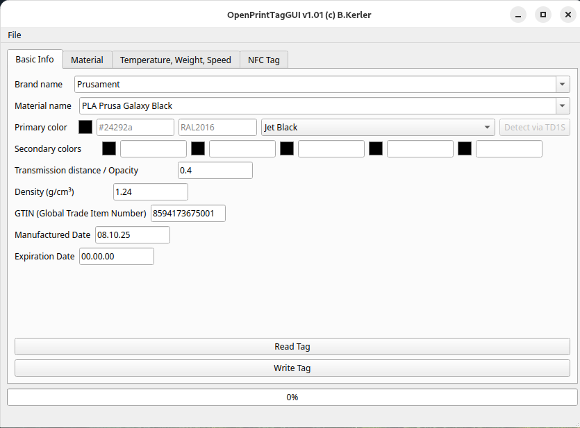
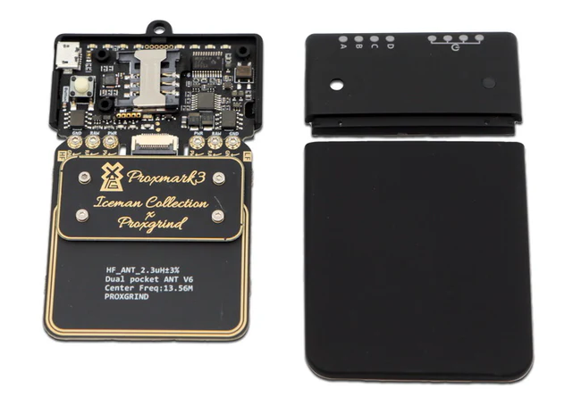
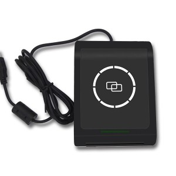
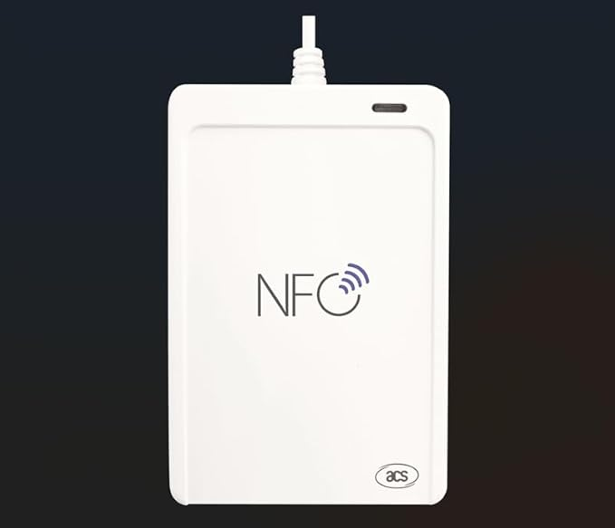

# OpenPrintTagGUI (c) B.Kerler 2025
GUI for the open print tag standard [openprinttag.org](https://openprinttag.org)
See specs [here](https://specs.openprinttag.org)



## Requirements
- python >= 3.10

### Optional
- [uv](https://docs.astral.sh/uv/)

## Installation
- using python virtual env
 ```shell
 git clone https://github.com/bkerler/OpenPrintTagGUI --recursive
 cd OpenPrintTagGUI
 python -m venv .venv
 source .venv/bin/activate
 pip3 install -r requirements.txt
 ```

- using [uv](https://docs.astral.sh/uv/)
 ```shell
 uv sync --frozen
 source .venv/bin/activate
 ```

## Usage
 ```shell
 python openprinttag_gui.py
 ```
or opening your tag binary directly
```shell
python openprinttag_gui.py yourtag.bin
```

## Currently supported
- Read/Write binary blobs that can be written using ProxMark3 cli

- Read/Write directly to tag using proxmark3 NFC Writer (~360 EUR)
  [Europe store](https://lab401.com/de-de/collections/rfid-tools/products/proxmark-3-rdv4)
  [USA store](https://hackerwarehouse.com/product/proxmark3-rdv4-kit)
  
  

- Read/Write directly to tag using YiQing/Fongwah S9 (~70 EUR)
  [Amazon store](https://www.amazon.de/dp/B0DLWNYHXD)
  
  

- Read/Write directly to tag using ACR1552U readers (~50 EUR)
  [Amazon store](https://www.amazon.de/dp/B0CNY5G8T3)

  

## Add custom filament to default settings
- Custom filaments are stored in "data/filaments" in its own file in yaml-Format:
```
brand_name: "My brand"
material_name:
  "My Filament":
    empty_container_weight: 193
    nominal_netto_full_weight: 850
    actual_netto_full_weight: 850
    material_type: ASA
    density: 1.07
    diameter: 2.85
    min_print_temperature: 250
    max_print_temperature: 270
    min_bed_temperature: 105
    max_bed_temperature: 115
    colors:
      Jet Black:
        primary_color: "#24292A"
        transmission_distance: 0.4
        uri: "https://www.mybrand.com/product/myfilament-jet-black-nfc/"
        tags:
          - abrasive
          - contains_carbon_fiber
      Woody Red:
        primary_color: "#D02F37"
        transmission_distance: 0.4
        uri: "https://www.prusa3d.com/product/prusament-asa-lipstick-red-800g-nfc/"
        tags:
          - abrasive
          - contains_wood
```

## Manually reading/writing using proxmark3 (ICODE-SLIX SLIX2 ISO15693) or NXP TagInfo App
using [Icemans Proxmark3 Fork](https://github.com/RfidResearchGroup/proxmark3)
- Identify tag
 ```shell
 hf 15 info
 ```

- Read tag
 ```shell
 hf 15 dump
 ```

- Write tag
 ```shell
 hf 15 restore -f mytag.bin
 ```

## ToDo
- Add more default filament data and colors
